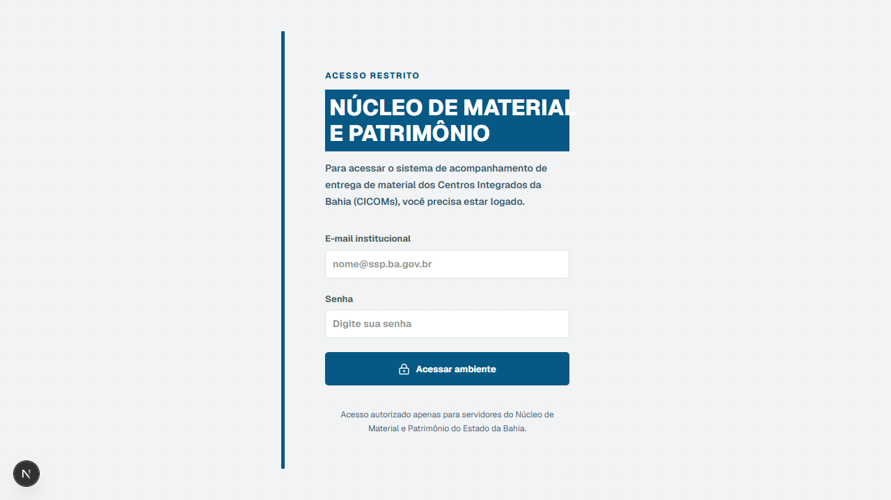
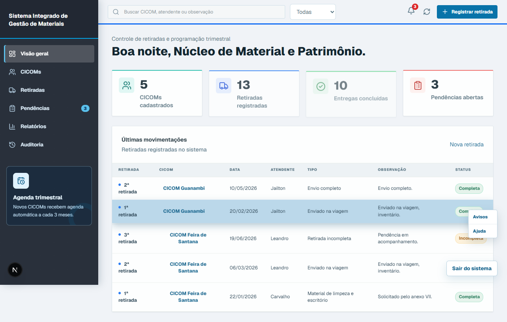
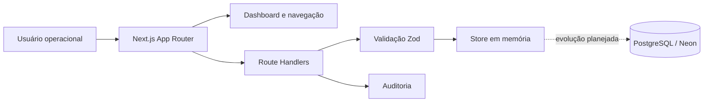
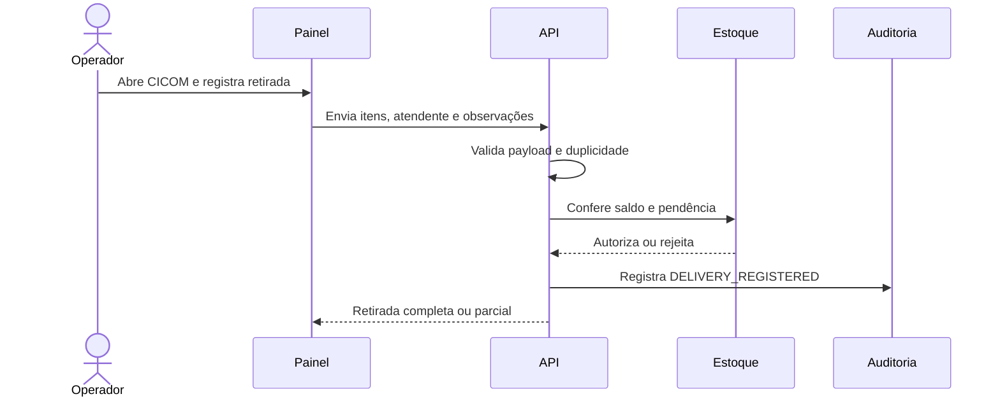

# SIGEMAT

Sistema Integrado de Gestão de Materiais para acompanhar CICOMs, solicitações, retiradas, pendências e auditoria operacional.

[](https://github.com/paulo/sigemat/actions/workflows/ci.yml)
[](https://nextjs.org/)
[](https://www.typescriptlang.org/)

## Navegação

- [Visão geral](#visão-geral)
- [Funcionalidades](#funcionalidades)
- [Imagens do projeto](#imagens-do-projeto)
- [Arquitetura](#arquitetura)
- [Estrutura](#estrutura)
- [Pré-requisitos](#pré-requisitos)
- [Executar localmente](#executar-localmente)
- [Testes](#testes)
- [API](#api)
- [Swagger](#swagger)
- [Banco de dados](#banco-de-dados)
- [CI e CD](#ci-e-cd)
- [Variáveis de ambiente](#variáveis-de-ambiente)

## Visão geral

O SIGEMAT oferece uma visão operacional do ciclo de materiais dos Centros Integrados de Comunicação (CICOMs) da Bahia. O painel permite consultar indicadores, registrar retiradas, acompanhar itens pendentes e consultar o histórico por unidade.

> **Estado atual:** a interface usa dados demonstrativos em memória para o fluxo visual. O schema PostgreSQL/Neon está versionado em [`database/neon-schema.sql`](database/neon-schema.sql), e as rotas de API usam o store em [`src/lib/store.ts`](src/lib/store.ts) enquanto a persistência definitiva não é conectada.

## Funcionalidades

- Login institucional para entrada no painel.
- Dashboard com CICOMs, retiradas, entregas concluídas e pendências.
- Cadastro de CICOM e agenda automática trimestral.
- Registro de retiradas completas e incompletas.
- Consulta de histórico, pendências, relatórios e auditoria.
- Busca, filtros, edição e exclusão dos registros exibidos.
- Atalhos para abrir o município no Google Maps.
- API preparada para CICOMs, materiais, entregas e indicadores do dashboard.

## Imagens do projeto

As imagens abaixo são capturas geradas do app em execução e ficam versionadas em [`docs/screenshots`](docs/screenshots).

### Acesso institucional



### Painel operacional



## Arquitetura



### Fluxo de uma retirada



## Estrutura

```text
src/
	app/api/                Route Handlers do Next.js
	app/globals.css         Estilos globais e responsividade
	app/layout.tsx          Metadata e fontes
	app/page.tsx            Interface do painel operacional
	lib/                    API, Neon e store de desenvolvimento
database/
	neon-schema.sql         Modelo relacional PostgreSQL
tests/
	api.test.ts             Testes unitários Jest
cypress/e2e/
	operacao.cy.ts          Teste de navegação E2E
.github/workflows/
	ci.yml                  Lint, Jest, build e Cypress
	cd.yml                  Deploy de produção na Vercel
```

## Pré-requisitos

- Node.js 20 ou superior.
- npm 10 ou superior.
- Chrome instalado para executar o Cypress localmente em modo headed, quando necessário.
- PostgreSQL/Neon apenas para a etapa de persistência real; o fluxo demonstrativo atual não exige banco.

## Executar localmente

```bash
git clone <url-do-repositorio>
cd SIGEMAT
npm install
npm run dev
```

Acesse [http://localhost:3000](http://localhost:3000). O formulário de acesso é demonstrativo nesta versão: qualquer e-mail e senha válidos no navegador permitem entrar no painel.

Para validar a versão de produção localmente:

```bash
npm run build
npm run start
```

## Testes

### Jest

Os testes unitários cobrem paginação, normalização dos parâmetros e metadados retornados pelos helpers da API.

```bash
npm test
npm run test:ci
```

### Cypress

O teste E2E autentica no fluxo demonstrativo, verifica os indicadores do dashboard e navega até a lista de CICOMs.

```bash
# terminal 1
npm run dev

# terminal 2
npm run e2e
```

Para abrir o runner interativo: `npm run e2e:open`.

## API

| Método | Rota | Responsabilidade |
| --- | --- | --- |
| `GET` | `/api/dashboard` | Indicadores consolidados do painel |
| `GET` | `/api/cicoms` | Lista paginada, busca e filtro de status |
| `POST` | `/api/cicoms` | Cadastro de CICOM com validação Zod |
| `GET` | `/api/deliveries` | Lista paginada de retiradas |
| `POST` | `/api/deliveries` | Registra entrega, atualiza estoque e auditoria |

As respostas paginadas seguem o formato `{ data, meta }`. Erros de validação retornam HTTP `422`; conflitos de negócio retornam `409` ou `422`, conforme o caso.

## Swagger

A documentação interativa está disponível em [`/swagger`](http://localhost:3000/swagger) durante o desenvolvimento. A especificação OpenAPI pode ser consumida diretamente em [`/api/openapi`](http://localhost:3000/api/openapi) ou consultada no arquivo [`docs/openapi.json`](docs/openapi.json).

## Banco de dados

O schema inclui usuários e perfis, CICOMs, categorias, materiais, solicitações, itens de solicitação, entregas, pendências, auditoria e notificações.

```bash
psql "$DATABASE_URL" -f database/neon-schema.sql
```

## CI e CD

- **CI:** [`ci.yml`](.github/workflows/ci.yml) executa `npm ci`, lint, Jest com cobertura, build e Cypress em pull requests e pushes para `main`.
- **CD:** [`cd.yml`](.github/workflows/cd.yml) publica a branch `main` na Vercel.

Configure estes secrets no ambiente `production` do GitHub:

```text
VERCEL_TOKEN
VERCEL_ORG_ID
VERCEL_PROJECT_ID
```
## Learn More

To learn more about Next.js, take a look at the following resources:

- [Next.js Documentation](https://nextjs.org/docs) - learn about Next.js features and API.
- [Learn Next.js](https://nextjs.org/learn) - an interactive Next.js tutorial.

You can check out [the Next.js GitHub repository](https://github.com/vercel/next.js) - your feedback and contributions are welcome!

## Deploy on Vercel

The easiest way to deploy your Next.js app is to use the [Vercel Platform](https://vercel.com/new?utm_medium=default-template&filter=next.js&utm_source=create-next-app&utm_campaign=create-next-app-readme) from the creators of Next.js.

Check out our [Next.js deployment documentation](https://nextjs.org/docs/app/building-your-application/deploying) for more details.
